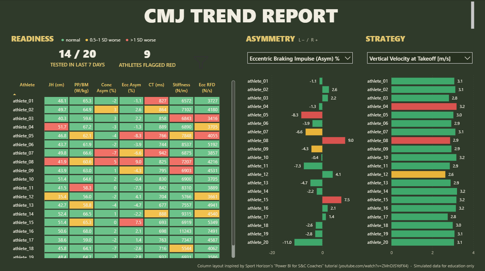

# CMJ Trend Report (Power BI)



A Power BI monitoring report for countermovement jump (CMJ) testing on VALD ForceDecks. Every athlete's **latest test is compared with their own testing history**, so staff can see in seconds who is jumping below their normal, and whether the change is in output, asymmetry or jump strategy.

Download it, open it, click **Refresh**: it runs on built-in simulated data. Point it at a folder of your own VALD exports and it runs on yours.

> **All data in this repo is simulated** for education and portfolio purposes. It doesn't represent any real athlete or organisation.

---

## What the report shows

| Section | What it shows |
|---|---|
| **Readiness** | A grid of every athlete across 7 key metrics (jump height, peak power/BM, concentric and eccentric braking impulse asymmetry, contraction time, stiffness, eccentric braking RFD). Each cell is coloured by how far the latest test sits from that athlete's own normal: **green** normal, **amber** 0.5–1 SD worse, **red** more than 1 SD worse. Tiles show athletes tested in the last 7 days and athletes flagged red. |
| **Asymmetry** | Per-athlete bars for the selected asymmetry metric (left negative, right positive). |
| **Strategy** | Per-athlete bars for the selected strategy metric: contraction time, takeoff velocity, force at zero velocity, countermovement depth, stiffness or eccentric braking RFD. |

### How readiness is scored

For each athlete and metric:

```
z = (latest test − athlete's own mean) / athlete's own SD
```

Each metric is scored in the direction that matters. Higher is better for jump height, power, velocity, force, stiffness and RFD. Lower is better for contraction time. A bigger asymmetry magnitude is worse. Countermovement depth is flagged when it changes a lot in either direction. Athletes need at least 3 tests before they are scored. Bars and grid cells share the same colour bands, and an "as of" date lets you look back at any point in the season.

---

## Quick start

1. Install [Power BI Desktop](https://powerbi.microsoft.com/desktop/) (Windows).
2. Download this repo (**Code → Download ZIP**) and **extract it**. Power BI can't open a project from inside a zip.
3. Open **`CMJTrendReport.pbip`** and click **Refresh**.

The simulated demo data is built into the report, so there's nothing to set up.

## Using your own data

1. Export CMJ tests from VALD Hub as CSV into a folder. You can keep adding exports over time.
2. In Power BI: **Transform data → Edit parameters** (inside Power Query: **Manage Parameters**).
3. Paste the folder path into **DataFolder**, for example `C:\Users\you\Documents\CMJ exports`.
4. **Refresh.** Clear DataFolder at any time to go back to the demo.

| Parameter | What it does |
|---|---|
| `DataFolder` | Blank = built-in demo. A folder path = every CSV in that folder and its subfolders. |
| `AnonymizeNames` | `true` shows `athlete_01, athlete_02 …` instead of names. Keep this on for screenshots and anything you share. |
| `ExportCulture` | `en-US` for MM/DD/YYYY dates, `en-GB` / `en-AU` for DD/MM/YYYY. |

### Built for real-world exports

The import is written to survive the ways VALD exports differ between accounts and over time:

- Column order doesn't matter, and extra columns are ignored.
- A missing column comes through blank instead of breaking the refresh.
- Header quirks are handled: trailing spaces, `[unit]` vs `(unit)`, and capitalisation.
- Lengths are reported in cm. Exports with jump height in inches are converted.
- Files holding several ForceDecks tests keep only bilateral CMJ rows, so SL CMJ, IMTP and other tests are skipped.
- Overlapping exports are de-duplicated.
- Comma or semicolon delimiters and UTF-8 BOMs are detected automatically.
- Double spaces in athlete names are cleaned up.

To check an export before opening Power BI:

```
python tools/check_export.py "C:\path\to\your\exports"
```

---

## Repo contents

```
CMJTrendReport.pbip            open this in Power BI Desktop
CMJTrendReport.Report/         report page and visuals (Power BI project format)
CMJTrendReport.SemanticModel/  tables, relationships and DAX measures (TMDL)
queries/                       readable copies of the Power Query (M) import code
sample_data/                   the simulated demo export as a plain CSV (also built into the report)
tools/make_demo_data.py        how the simulated data is generated
tools/check_export.py          checks an export against the import rules
assets/screenshot.png          report preview
```

## How the demo data is built

`tools/make_demo_data.py` simulates a season of weekly CMJ testing for 20 athletes from scratch, not from any real dataset:

- Each athlete gets traits for bodyweight, jump ability, countermovement strategy and side bias.
- Metrics are physically linked. Takeoff velocity comes from jump height (impulse–momentum), concentric force from bodyweight, velocity and depth (work–energy), and stiffness from force over depth.
- The season has a pre-season build and a mid-summer fatigue dip.
- Four return-to-play athletes start mid-season about 20% down, with asymmetries that close over time.
- Test-to-test noise is in line with typical CMJ reliability (about 3–5% for jump height).

## Credits

The three-column layout is inspired by the CMJ team report in Sport Horizon's tutorial [Power BI for Strength & Conditioning (S&C) Coaches: Tutorial & Course Discount!](https://www.youtube.com/watch?v=ZMnDJSYdFX4). For more of their Power BI education for coaches and sport scientists, see [sporthorizon.co.uk](https://www.sporthorizon.co.uk/). The readiness grid, z-score logic, plug-and-play import, simulated dataset and tooling are my own work.

## Privacy

Keep real exports outside the repo, or in `data/`, `exports/` or `private/`, which `.gitignore` excludes along with Power BI's local data cache. Leave `AnonymizeNames = true` for screenshots and anything you share.

---

Built by **Nate Kolb**, MSc, RSCC, CPSS · strength and conditioning coach and sport scientist
